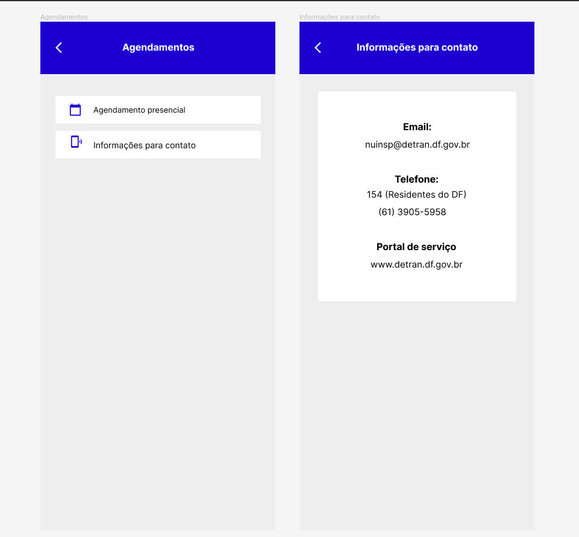

# Validação Informal

## 1. Introdução
A prototipação é uma técnica de validação que possibilita que o usuário valide requisitos interagindo com um modelo da funcionalidade, para que ele possa ter uma melhor visão do que se tratam os requisitos apresentados.

## 2. Metodologia
Para realizar essa tarefa, o grupo designou um integrante (Thiago), que criou um protótipo com funcionalidades de acordo com requisitos elicitados que ainda não existem no sistema do DetranDF, para assim realizar a validação.
 
### 2.1 Requisitos Prototipadas
| Número | Requisito |
| RF35 |Deve ser possível realizar pagamento de multa |
| RF7 |O usuário deve ser capaz de encontrar os números de contato do Detran |

## 3. Resultados
 Segue abaixo da prototipação realizado pela equipe. [Clicando aqui](https://www.figma.com/file/UwjXsp15GZa9lRzebWIFRP/DetranDF?node-id=0%3A1) você pode visualizar o protótipo realizado.

*Figura 1: Protótipo pagamento de multa*

*Figura 2: Protótipo informações para contato*

 
## 4. Referências Bibliográficas
> DEPARTAMENTO DE TRÂNSITO. Detran-DF amplia canais de agendamento de serviços. Disponível em: http://www.detran.df.gov.br/detran-df-disponibiliza-agendamento-de-servicos-de-veiculos-e-habilitacao-pelo-site/#:~:text=Central%20de%20Atendimento%20ao%20Cidad%C3%A3o%3A%20telefone%20154%20(para%20quem%20est%C3%A1,quem%20est%C3%A1%20fora%20do%20DF).&text=site%2C%20portal%20ou%20154.&text=exclusivamente%20pelo%20site.,-Inspe%C3%A7%C3%A3o%20veicular%20(para&text=por%20e%2Dmail%3A%20nuinsp%40,%2D5958%20e%203905%2D5951. Acesso em: 17/08/2022

## 5. Histórico de Versão

|Versão|    Data    |    Descrição         | Autor        | Revisor |
|:----:|:----------:|:---------         --:|:------------:|:-------:|
| 0.1  | 17/08/2022 |Criação da página    |  Thiago Gomes    |     Christian Fleury    |
| 0.2  | 17/08/2022 |Adição de resultados do protótipo    |  Thiago Gomes    |     Christian Fleury    |

