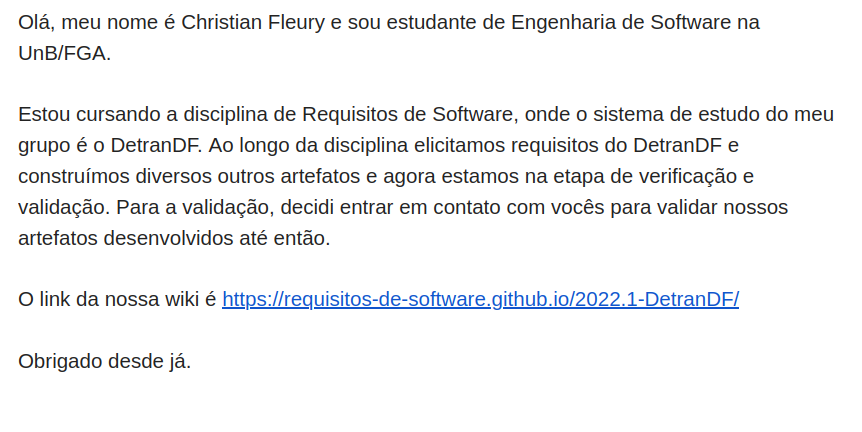

# Validação Informal

## 1. Introdução
A validação informal é uma tarefa de leitura de descrições em linguagem natural e do uso dos interessados para identificar problemas.

## 2. Metodologia
Para realizar essa tarefa, o grupo designou um integrante (Christian) que enviou um email para tentar contato com a equipe de desenvolvimento do DetranDF para assim realizar a validação.
 
### 2.1 Email enviado
O email enviado pode ser visto na Figura 1.

*Figura 1: Email Enviado*

## 3. Resultados
Até o momento, não obtemos resposta da equipe de desenvolvimento. Se recebermos alguma resposta, a sessão de resultados será atualizada. 
 
## 4. Referências Bibliográficas
> SERRANO, Maurício; SERRANO, Milene; Requisitos - Aula 23  
> LUCAS; PEDRO; Aula Análise

## 5. Histórico de Versão

|Versão|    Data    |    Descrição         | Autor        | Revisor |
|:----:|:----------:|:---------         --:|:------------:|:-------:|
| 0.1  | 17/08/2022 |Criação da página    |  Christian    |     Thiago    |
 | 0.1  | 17/08/2022 |Adição do revisor    |  Christian    |     Thiago    |

