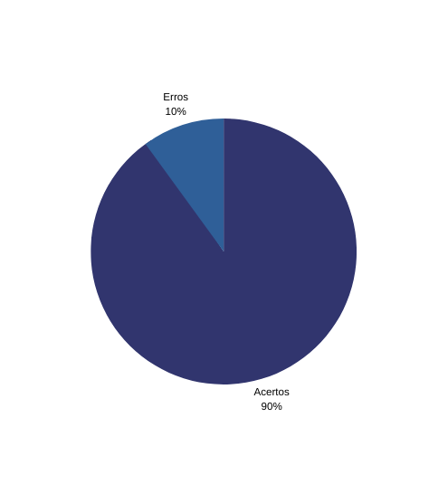

# Verificação backward-from

## **1. Contexto**

- Técnica utilizada: Inspeção com checklist.
- Autor do documento: Alex, Matheus e Paulo.
- Inspetor: Alex.

## **2. Checklists**

Abaixo segue a tabela com as informações da lista de controle de verificação do [backward-from](../../pos_rastreabilidade/backward_from.md):

|Id|Questões|Resposta|
|:---:|---|:---:|
|1|O artefato possui uma introdução e a metodologia utilizada?|✔|
|2|Possui a matriz de requisitos funcionais?|✔|
|3|Possui a matriz de requisitos não funcionais?|✔|
|4|Todos os requisitos elicitados estão descritos nessas matrizes?|✔|
|5|Foi explicitado as origens dos requisitos?|✔|
|6|Foi definido elos para todos os requisitos?|✖|
|7|Os elos possuem tipos?|✔|
|8|foi utilizado o meta-modelo de Toranzo?|✔|
|9|Os requisitos descritos são verificáveis?|✔|
|10|O artefato possui hiperlink para os artefatos mencionados?|✔|

## **3. Acompanhamento**

Foram verificados 10 itens no artefato backward-from onde apenas 1 deles não foi atendido. Segue o gráfico: 

<h6 align = "center">Figura 1: Gráfico acertos/erros do checklist</h6>

## **4. Conclusão**

O artefato não possui muitos problemas, deve-se melhorar na descrição dos elos e alguns requisitos não possuem descrição de relacionamento.

## Histórico de Versão

| Versão |    Data    |       Descrição       |     Autor     |    Revisor    |
|:------:|:----------:|:---------------------:|:-------------:|:-------------:|
|0.1|07/09|criação do documento|Alex|Matheus|