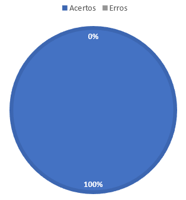

# Verificação Brainstorm

## **1. Preparação**

- Técnica Utilizada: Inspeção Check-List
- Autores do documento: Paulo
- Inspetor: Arthur Henrique
  
O documento que estará sendo verificado pode ser acessado [aqui](../../elicitação/brainstorm.md)

## **2. Inspeção**

| ID | Questões | Respostas |
|----|----------|-----------|
|1   |O brainstorm possui gravação em video?|&#10006|
|2   |Possui requisitos importantes?|&#10004|
|3   |É de facil entendimento e organizado?|&#10004|
|4   |É possivel identificar quais foram os participantes?|&#10004 |
|5   |Foram validados os requisitos gerados? |&#10004|

*Tabela 1: Checklist*

## **3. Correção**

É possivel identificar que não tem a gravação do brainstorm ja que a mesma foi realizada presencialmente em horario de aula disponibilizado para desenvolvimento do projeto, tirando isso os outros checks puderam ser validados corretamente não sendo encontrados erros graves.

## **4. Acompanhamento**

A seguir é possivel visualizar na *Figura 1: Grafico de acerto do brainstorm* a porcentagem de acerto obtido no checklist

<h6 align = "center">Figura 1: Grafico de acerto do brainstorm</h6>

## 5. Histórico de versão

|  Versão   | Data | Descrição           | Autor  | Revisor|
|-----------|------|---------------------|--------|--------|
| 0.1 | 17/08/2022 |Criação da página    | Arthur |Alex   |
| 0.2 | 17/08/2022 |Adição de legendas nas tabelas    | Arthur |Alex   |
|0.3  | 10/09 | Adaptação para modelo de fagan | Arthur | Alex |

