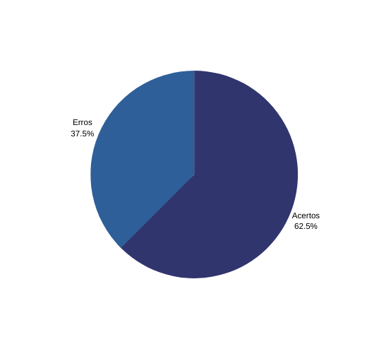

# Verificação da especificação suplementar

## **1. Contexto**

- Técnica utilizada: Inspeção com checklist.
- Autor do documento: Matheus.
- Inspetor: Alex.

## **2. Checklist**

Abaixo segue a tabela com as informações da lista de controle de verificação da [especificação suplementar](../../modelagem/especificacao.md):

|Id|Questões|Respostas|Respostas pós Reunião de Consolidação
|:---:|---|:---:|:-----:
|1|A especificação suplementar segue o modelo FURPS+?|✔ |✔
|2|O documento especifica a usabilidade?|✖|Não se aplica
|3|O documento especifica a compatibilidade?|✖| Não se aplica
|4|O documento especifica qual plataforma o aplicativo pode ser executado?|✔|✔
|5|O documento especifica a confiabilidade?|✖| Não se aplica
|6|O documento especifica o desempenho?|✔|✔
|7|O documento especifica o tempo de resposta, no Desempenho?|✔|✔
|8|Todos os requisitos são verificáveis?|✔|✔

<h6 align = "center">Tabela 1: checklist do documento de especificação suplementar Fonte: Autores</h6>

## **3. Acompanhamento**

Foram verificados 8 itens no artefato de priorização, no qual 3 estão incorretos. Segue o gráfico: 

<h6 align = "center">Figura 1: Gráfico acertos/erros do checklist da especificação suplementar Fonte: autores</h6>

## **4. Conclusão**

A maioria das categorias do modelo furps+ não são especificadas, deve-se adicionar, ao documento, informações que abordem mais requisitos não-funcionais de acordo com cada categoria.

## **5. Reunião de Consolidação**

No dia 10/09/2022 os integrantes Alex e Matheus discutiram a respeito dos resultados do checklist e, após essa conversa, foi gerado um novo resultado.

Os itens que na primeira verificação estavam marcados com um "✖" foram colocados em pauta pelo integrante Matheus, para que pudesse ser feita uma correção no artefato, e o integrante Alex, que havia feito a verificação, explicou que seria coerente se no documento da [Especificação Suplementar](../../modelagem/especificacao.md) houvesse uma descrição melhor a respeito das categorias do FURPS+ que não foram incluídas na "Tabela 1: categorização dos requisitos não funcionais".

Mas em resposta a isso, o autor do artefato explicou que a categorização se dava com base nos requisitos não-funcionais elicitados pelo grupo, e diante disso, visto que os requisitos que o grupo elicitou se encaixavam apenas em duas das categorias do FURPS+, os itens que antes estavam com "✖" foram reconsiderados e passaram a ser considerados com "Não se aplica".

***
## Histórico de Versão

| Versão |    Data    |       Descrição       |     Autor     |    Revisor    |
|:------:|:----------:|:--------|:-------------:|:-------------:|
|0.1|17/08/2022|Criação do documento|Alex|Paulo|
|0.2|10/09/2022|Adição da documentação da Reunião de Consolidação|Matheus|Paulo|