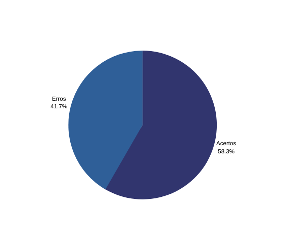

# Verificação Forward-from

## **1. Contexto**

- Técnica utilizada: Inspeção com checklist.
- Autor do documento: Alex, Matheus e Paulo.
- Inspetor: Alex.

## **2. Checklists**

Abaixo segue a tabela com as informações da lista de controle de verificação do [forward-from](../../pos_rastreabilidade/forward_from.md):

|Id|Questões|Resposta|
|:---:|---|:---:|
|1|O artefato possui uma introdução e a metodologia utilizada?|✔|
|2|Possui matriz de rastreabilidade de requisitos?|✔|
|3|Todos os requisitos elicitados estão descritos?|✔|
|4|Foram descritas as ligações com os léxicos?|✔|
|5|Foram descritas as ligações com as Historias de usuário?|✔|
|6|Foram descritas as ligações com os casos de uso?|✖|
|7|Foram descritas as ligações com os Cenários?|✔|
|8|Foram descritas as ligações com os épicos?|✖|
|9|Foram explicitadas as telas/protótipos das funcionalidades implementadas?|✖|
|10|Foram definidas as categorias dos requisitos utilizando o meta-modelo de Toranzo?|✖|
|11|Os requisitos descritos são verificáveis?|✔|
|12|O artefato possui hiperlink para os artefatos mencionados?|✖|

## **3. Acompanhamento**

Foram verificados 12 itens no artefato forward-from onde 5 deles não foram atendidos. Segue o gráfico: 

<h6 align = "center">Figura 1: Gráfico acertos/erros do checklist</h6>

## **4. Conclusão**

Os casos de uso, épicos, telas e protótipos não foram mencionados na matriz, devem ser descritos. Não foram definidas as categorias dos requisitos seguindo o meta-modelo de Toranzo. A matriz não possui hiperlinks, devem ser implementados em todos os artefato mencionados para facilitar a navegação do artefato.

## Histórico de Versão

| Versão |    Data    |       Descrição       |     Autor     |    Revisor    |
|:------:|:----------:|:---------------------:|:-------------:|:-------------:|
|0.1|07/09|criação do documento|Alex|Matheus|