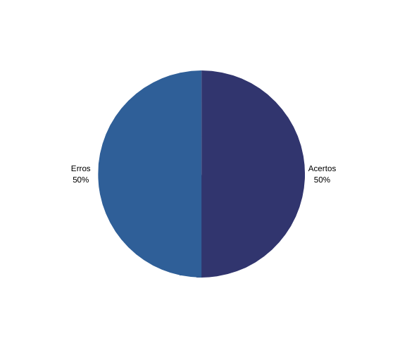

# Verificação da priorização
***

## **1. Contexto**

- Técnica utilizada: Inspeção com checklist.
- Autor do documento: Thiago e Matheus.
- Inspetor: Alex.

## **2. Checklist**

Abaixo segue a tabela com as informações da lista de controle de verificação da [priorização](../../elicita%C3%A7%C3%A3o/prioriza%C3%A7%C3%A3o/moscow.md):

|Id|Questões|Resposta|Respostas pós Reunião de Consolidação
|:---:|---|:---:|:-----:
|1|Todos os requisitos funcionais foram priorizados?|✔ |✔
|2|Os requisitos não-funcionais foram priorizados?|✔ |✔
|3|Utilizou mais de uma técnica de priorização?|✖| ✔
|4|As técnicas utilizadas foram aplicadas de forma correta?|✔|✔
|5|A execução da técnica de priorização foi gravada?|✖| ✔
|6|O cliente/usuário participou da priorização?|✖| ✔

<h6 align = "center">Tabela 1: checklist do documento de priorização Fonte: autores</h6>

## **3. Acompanhamento**

Foram verificados 6 itens no artefato de priorização, no qual 3 estão corretos. Segue o gráfico: 

<h6 align = "center">Figura 1: Gráfico acertos/erros checklist Fonte: autores</h6>

## **4. Conclusão**

A técnica utilizada, o MoSCoW, foi aplicada de forma correta, mas falta a gravação da execução da técnica com a participação do cliente/usuário. Seria interessante aplicar mais de uma técnica na etapa de priorização.

## **5. Reunião de Consolidação**

No dia 10/09/2022 os integrantes Christian, Alex e Matheus discutiram a respeito dos resultados do checklist e, após essa conversa, foi gerado um novo resultado.

Antes da data referenciada, em algumas discussões em aula com a presença do professor, foi observado o resultado do checklist, e notou-se a falta de mais uma técnica de priorização.

Diante disso, em meio a essas discussões, o integrante Christian havia se comprometido a implementar o uso de mais uma técnica de priorização, sendo ela a _Return On Investment_.

Com isso, na data referenciada, o autor da verificação (Alex), um dos autores do artefato (Matheus) e o integrante Christian, que havia se comprometido a realizar as correções, se reuniram para analisar como estava o andamento dessas correções, e o retorno foi de que havia sido implementada a nova técnica mencionada, com a presença de um usuário do aplicativo e que essa elicitação havia sido gravada, atendendo os itens faltantes do checklist.

***

## Histórico de Versão

| Versão |    Data    |       Descrição       |     Autor     |    Revisor    |
|:------:|:----------:|:---------------------:|:-------------:|:-------------:|
|0.1|17/08/2022|Criação do documento|Alex|Paulo|
|0.2|10/09/2022|Adição da Reunião de consolidação|Matheus|Thiago|