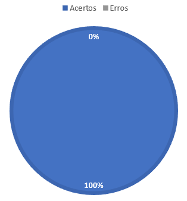

# Verificação Rich Picture

## **1. Preparação**

- Técnica Utilizada: Inspeção Check-List
- Autores do documento: Alex Gabriel e Matheus Costa
- Inspetor: Arthur Henrique
  
O documento que estará sendo verificado pode ser acessado [aqui](../../prerastreabilidade/richPicture/richpicture.md)

## **2. Inspeção**

| ID | Questões | Respostas |
|----|----------|-----------|
|1   |O desenho é de facil compreensão?|&#10004|
|2   |Possui Legenda e com sentido?|&#10004|
|3   |Possui fronteiras?|&#10004|
|4   |Os atores estão posicionados fora da fronteira?|&#10004 |
|5   |As relações fazem sentido? |&#10004|
|6   |Aborda todos os aspectos do aplicativo? |&#10004|
|7   |Os simbolos estão claros? |&#10004|

*Tabela 1: Checklist*

## **3. Correção**
Todos os checklists foram corretamente validades sendo assim dispensada a necessidade de realizar correções.

## **4. Acompanhamento**

A seguir é possivel visualizar na *Figura 1: Grafico de acerto do rich picture* a porcentagem de acerto obtido no checklist

<h6 align = "center">Figura 1: Grafico de acerto do rich picture</h6>

## 5. Histórico de versão

|  Versão   | Data | Descrição           | Autor  | Revisor|
|-----------|------|---------------------|--------|--------|
| 0.1 | 17/08/2022 |Criação da página    | Arthur |Paulo |
| 0.2 | 17/08/2022 |Adição de legendas nas tabelas    | Arthur |Paulo   |
|0.3  | 10/09 | Adaptação para modelo de fagan | Arthur | Alex |

