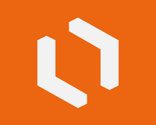

# Ferramentas Utilizadas

A Tabela 1 indica quais foram as ferramentas utilizadas pelo nossa equipe no projeto:

| Ferramenta | Nome | Descrição | Onde foi utilizada|
|:--:|:--:|:--:|:---|
|  | [Detran-DF](https://play.google.com/store/apps/details?id=br.com.mesotec.detrandf&hl=en&gl=US) | Com o DetranDF é possível realizar diversos serviços a partir do celular. Nessa versão o cidadão poderá consultar várias informações sobre a sua Habilitação, seus Veículos, gerar seu CRLV Digital e muito mais. |O aplicativo foi utilizado durante todas as etapas do projeto, foi o aplicativo selecionado para aplicar a teoria de requisitos de software|
|  | [Discord](https://discordapp.com) | Plataforma de comunicação para chamadas de áudio, vídeo e compartilhamento de tela |O aplicativo foi utilizado em todas as etapas do projeto para reuniões de equipe |
|  | [Google Docs](https://docs.google.com) | Ferramenta para criação de documentos simultaneamente entre os integrantes |O aplicativo foi utilizado em todas as etapas do projeto|
|  | [Google Sheets](https://www.google.com/sheets/about/) | Ferramenta para criação de planilhas simultaneamente entre os integrantes |O aplicativo foi utilizado na etapa de planejamento para definir os horários dos membros|
|  | [GitHub](https://github.com) | Plataforma de versionamento em que iremos armazenar todos os arquivos relacionados ao projeto |O aplicativo foi utilizado em todas as etapas do projeto para organização da documentação|
|  | [Microsoft Office 365](www.office.com) | Versão online do Microsoft Office |O aplicativo foi utilizado em todas as etapas do projeto|
|  | [Whatsapp](https://web.whatsapp.com/) | Ferramenta de comunicação instantânea entre os integrantes |O aplicativo foi utilizado em todas as etapas do projeto para comunicação entre a equipe|
|  | [VSCode](https://code.visualstudio.com/) | Editor de código destinado ao desenvolvimento de aplicações com controle Git incorporado |O aplicativo foi utilizado em todas as etapas do projeto como ferramenta de escrita|
|  | [PyCharm](https://www.jetbrains.com/pycharm/) | Ambiente de desenvolvimento destinado ao desenvolvimento de aplicações com controle Git incorporado |O aplicativo foi utilizado em todas as etapas do projeto|
|  | [Microsoft Teams](https://www.microsoft.com/pt-br/microsoft-365/microsoft-teams/free) | Plataforma usada para a gravação dos vídeos de apresentação do projeto |O aplicativo foi utilizado em todas as etapas do projeto para gravação das entregas|
||[Lucidchart](https://www.lucidchart.com/br)|O Lucidchart é um aplicativo de diagramação inteligente que combina diagramação, visualização de dados e colaboração para acelerar o entendimento e impulsionar a inovação|O aplicativo foi utilizado durante a modelgem de requisitos|
<h6 align = "center">Tabela 1: Ferramentas utilizadas Fonte: Autores</h6>

***
## Histórico de Versão

| Versão      | Data       | Descrição                         | Autor     | Revisor |
|-------------|------------|-----------------------------------|-----------|---------|
|0.1|09/09|Criação do artefato|Alex|Matheus|
