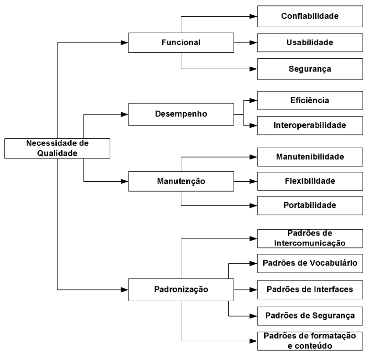

# *Quality attributes Scenarios Essentials* - QaSE
***

## 1. Introdução
Os *quality scenarios* são uma técnica de modelagem elaborada com base nas adaptações
dos cenários propostos por [Robertson, 2006] e das práticas descritas no EssUP (Essentials
Unified Process) por [Jacobson, 2010].

Os *quality scenarios* compõem a prática *Quality attributes Scenarios Essentials* e, serão
propostos com intuito de padronizar a elaboração dos cenários, possibilitando melhor compreensão
dos requisitos não-funcionais elicitados junto ao stakeholder. Eles são uma técnica de
modelagem dos *Non Functional Requirements* (NFR) que abordam e descrevem os requisitos, relatam as interdependências e conflitos
existentes entre os requisitos não-funcionais, os possíveis impactos que podem vir a afetar o
sistema caso ocorra o não atendimento dos requisitos.

Dessa forma, será possível implementar o sistema tendo conhecimento de cada NFR, de
cada dependência e/ou conflito, possibilitando a elaboração de soluções mais eficazes para o
problema existente em uma organização.

## 2. Metodologia
Essa prática refere-se à utilização de modelos para facilitar a compreensão de requisitos
não-funcionais, produzindo uma documentação útil para o desenvolvimento de software,
conduzindo as atividades de desenvolvimento para:

* Elicitar e priorizar os requisitos não-funcionais; 
* Informar os requisitos e o comportamento do sistema ao realizar ações e serviços; 
* Enxergar as interdependências e conflitos entre os requisitos e entender como eles
estão relacionados um ao outro; 
* Empregar o modelo correto para a modelagem de NFR, a fim de atender às
necessidades; 
* Ser ágil em sua abordagem para modelagem e documentação; 
* Focar nos NFR *Essentials* evitando a interrupção da modelagem em *Quality
Scenarios*, a produção de documentos desnecessários e que não sejam ágeis.

Para facilitar o processo de elicitação destes requisitos não funcionais, a partir da técnica proposta, usou-se  de base
um padrão organizacional proposto por [Loucopoulos, 1995]. O capítulo seguinte tem o objetivo de descrever o padrão citado. 

## 3. Solução Proposta
Foi proposto um modelo genérico para qualidade de software, a partir do qual os requisitos de qualidade podem ser
decompostos. Este modelo foi originado a partir das necessidades de qualidade de software descritas por [Loucopoulos, 1995].
A figura a seguir ilustra o modelo:

<h6 align="center"> Figura 1: Modelo necessidades de qualidade de software </h6>
<h6 align="center"> Fonte: <a href="https://tedebc.ufma.br/jspui/bitstream/tede/438/1/Francisco%20de%20Assis.pdf">[Assis, 2010]</a> </h6>

## 6. Referências Bibliográficas

> [Robertson, 2006] ROBERTSON, Suzanne; ROBERTSON, James. Customer
> Satisfaction/dissatisfaction – Mastering the Requirements Process (Volere). 2ª ed, 2006.

> [Jacobson, 2010] JACOBSON, Ivar. Essential Practices – The Smart Way. Disponível em:
> http://www.ivarjacobson.com/resource.aspx?id=408. 
> Acessado em: 08/09/2022.

> [Sales de Brito, 2010] SALES DE BRITO, Rebeka. Uma Proposta para Modelagem de Requisitos Não-Funcionais em Projetos Ágeis. 
> Disponível em: https://repositorio.ufpe.br/bitstream/123456789/2394/1/arquivo3221_1.pdf.
> Acessado em: 08/09/2022.

> [Assis, 2010] BASTOS FILHO, Francisco de Assis Menêzes. ELICITAÇÃO DE REQUISITOS NÃO FUNCIONAIS EM CONFORMIDADE COM
> POLÍTICAS DE QUALIDADE PARA APLICAÇÕES MÉDICAS. 
> Disponível em: https://tedebc.ufma.br/jspui/bitstream/tede/438/1/Francisco%20de%20Assis.pdf.
> Acessado em: 08/09/2022.
## 7. Histórico de Versão

| Versão |    Data    |      Descrição       | Autor | Revisor |
|:------:|:----------:|:--------------------:|:-----:|:-------:|
|  0.1   | 08/09/2022 | Criação do documento | Paulo |  Alex   |