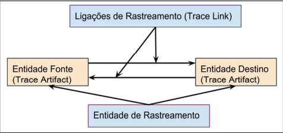

# Foward From

## 1. Introdução
O processo de pós-rastreabilidade de requisitos é eficiente quando for possível identificar os autores/responsáveis 
por cada etapa do ciclo de vida de um requisito, isso pode ser traduzido em informações que possibilitam reconhecer
a origem, motivo e relações com artefatos que determinado requisito possui. Para tal, existem uma série de técnicas na literatura que
podem auxiliar no desenvolvimento deste processo.

## 2. Metodologia
Cleland-Huang cita em uma de suas obras que rastreabilidade, em seu fundamento, se refere ao potencial para relacionar dados
já existentes em algum artefato somado à habilidade de examinar estas relações. Isso induz em uma dependência 
de criar ligações navegáveis entre o conteúdo presente nos artefatos que, por ora, poderiam estar desconectados.

Os principais conceitos relacionados a rastreabilidade são:

* Ligação de rastreamento (*Trace Link*): Associações semânticas entre duas entidades de rastreamento: fonte e destino.
* Entidade de rastreamento (*Trace Artifacts*): Unidade que pode ser agrupada por tipo e características de sua estrutura, como: histórias de usuários, léxicos e 
  cenários.
* Relação de rastreamento (*Trace Relation*): Consiste em todas a ligações de rastreamento criadas entre dois conjuntos de tipos específicos de artefatos.

A figura abaixo ilustra a relação entre os conceitos apresentados:

<h6 align = "center">Figura 1: Conceitos Foward-From</h6>
<h6 align = "center">Fonte: [1]Silva, Paulo Robson</h6>

Uma relação de rastreabilidade pode ser registrada em uma matriz de rastreabilidade, a qual pode ser traduzida como uma 
tabela que registra os artefatos, suas fontes e destino. A estratégia adotada por nosso grupo foi a de criação desta matriz,
 adaptando-a aos artefatos de modelagem já construídos anteriormente. Desta forma foi possível criar um método de rastreabilidade
eficiente e de fácil interpretação.

## 3. Requisitos
Abaixo segue a tabela de matriz de rastreabilidade, resultante da aplicação da metodologia apresentada: 

| Número | Requisito | História de Usuário | Léxico | Cenário
|:-:|:-:|:-:|:-:|:-:|
| RF1 |O usuário deve ser capaz de se registrar no aplicativo                              | US01 | - | C01  |
| RF2 |O usuário deve ser capaz de fazer o login na sua conta                              | US02 | - | C02  |
| RF3 |O usuário deve ser capaz de visualizar sua CNH eletrônica                           | US05 | - | C05  |
| RF4 |O usuário deve ser capaz de visualizar suas multas                                  | US10 | - | C06  |
| RF5 |O usuário deve ser capaz de consultar os pontos da carteira                         | US18 | - | -  |
| RF6 |O usuário deve ser capaz de fazer um agendamento de atendimento presencial          | US17 | - | -  |
| RF7 |O usuário deve ser capaz de encontrar os números de contato do Detran               | - | - | -  |
| RF8 |O usuário deve ser capaz de solicitar 2ª via da CNH                                 | US06 | - | C05  |
| RF9 |O usuário deve ser capaz de gerar boletos para pagar suas multas                    | US10 | - | C06  |
| RF10 |Deverá ser possível acessar a habilitação	                                       | US05 | - | C05  |
| RF11 |Deverá ser possível consultar o veículo                                            | US11 | - | -  |
| RF12 |Deverá ser possível consultar infrações                                            | US18 | - | -  |
| RF13 |Deverá ser possível agendar atendimentos                                           | US17 | - | -  |
| RF14 |Deve ser possível consultar informações sobre multas                               | US18 | - | C06  |
| RF15 |Deve ser possível consultar informações sobre documentos                           | - | - | -  |
| RF16 |Deve ser possível realizar transferências de veículos de forma eletrônica          | US12 | - | -  |
| RF17 |Deve ser possível consultar informações históricas sobre o veículo                 | - | - | -  |
| RF18 |Deve ser possível emitir eletrônicamente o CRLV                                    | US13 | - | -  |
| RF19 |Deve ser possível alterar o endereço do proprietário do veículo                    | US14 | - | -  |
| RF20 |Deve ser possível emitir o ATPV                                                    | US15 | - | -  |
| RF21 |Deve ser possível agendar vistorias veiculares                                     | US16 | - | C04  |
| RF22 |Deve ser possível emitir CNH eletrônica                                            | US05 | - | C05  |
| RF23 |Deve ser possível consultar informações sobre bloqueios                            | US07 | - | -  |
| RF24 |Deve ser possível consultar informações sobre ocorrências                          | US08 | - | -  |
| RF25 |Deve ser possível emitir documento de nada consta                                  | US09 | - | -  |
| RF26 |Deve ser possível consultar informações sobre processo de obtenção da habilitação  | - | - | C05  |
| RF27 |Deve ser possível solicitar CNH definitiva                                         | - | - | C05  |
| RF28 |Deve ser possível solicitar 2ª via de CNH                                          | US06  | - | C05  |
| RF29 |Deve ser possível solicitar autorização de estacionamento para idosos              | - | - | -  |
| RF30 |Deve ser possível solicitar autorização de estacionamento para PCDs                | - | - | -  |
| RF31 |Deve ser possível modificar endereço do proprietário da CNH                        | US03 | - | C05  |
| RF32 |Deve ser possível consultar infrações                                              | US18 | - | -  |
| RF33 |Deve ser possível transferir pontos de infrações                                   | US18 | - | -  |
| RF34 |Deve ser possível transferir titularidade de multa                                 | - | - | C06  |
| RF35 |Deve ser possível realizar pagamento de multa                                      | US19 | - | C06  |
| RF36 |Deve ser possível agendar serviços                                                 | US17 | - | C07  |
| RF37 |Deve ser possível escolher data de agendamento                                     | US17 | - | C07  |
| RF38 |Deve ser possível escolher unidade de agendamento                                  | US17 | - | C07  |
| RF39 |Deve ser possível escolher hora de agendamento                                     | US17 | - | C07  |
| RF40 |Deve ser possível consulta endereço de unidades                                    | US17 | - | -  |
| RF41 |Deve ser possível realizar contato com ouvidoria                                   | - | - | -  |
| RF42 |Deve ser possível alterar email                                                    | US04 | - | -  |
| RF43 |Deve ser possível alterar senha                                                    | US04 | - | -  |
| RF44 |Deve ser possível reenviar e-mail de validação                                     | - | - | -  |
| RF45 |Deve ser possível cadastrar biometria                                              | - | - | -  |
| RF46 |Deve ser possível cadastrar Cpf/Cnpj                                               | US01 | - | -  |
| RF47 |Deve ser possível consultar pontuação de infrações associadas ao condutor          | US18 | - | C06  |
| RF48 |Deve ser possível cadastrar uma senha                                              | US04 | - | C01  |

<h6 align = "center">Tabela 1: Foward From</h6>

## 4. Referência Bibliográficas
> Sayão, Miriam. Leite, Julio Cesar Sampaio do Prado. Rastreabilidade de Requisitos. ISSN 0103-9741. 
> Disponível em: https://www.dbd.puc-rio.br/depto_informatica/05_20_sayao.pdf. Acesso em: 23 agosto 2022.

> [1]Silva, Robson Paulo da. Modelo de rastreabilidade de requisitos aplicada a gestão de projetos em métodos ágeis. 
> Disponível em: https://repositorio.ufrn.br/handle/123456789/22079.
> Acessado em: 23/08/2022

> Cleland-Huang, Jane, Orlena Gotel, and Andrea Zisman. Software and systems traceability. Vol. 2. No. 3. London: Springer, 2012.

## 5. Histórico de Versão

| Versão | Data       | Descrição            | Autor                     | Revisor                |
|:------:|------------|----------------------|---------------------------|------------------------|
|  0.1   | 23/08/2022 | Criação do documento | Paulo, Christian e Thiago | Alex, Arthur e Matheus |

